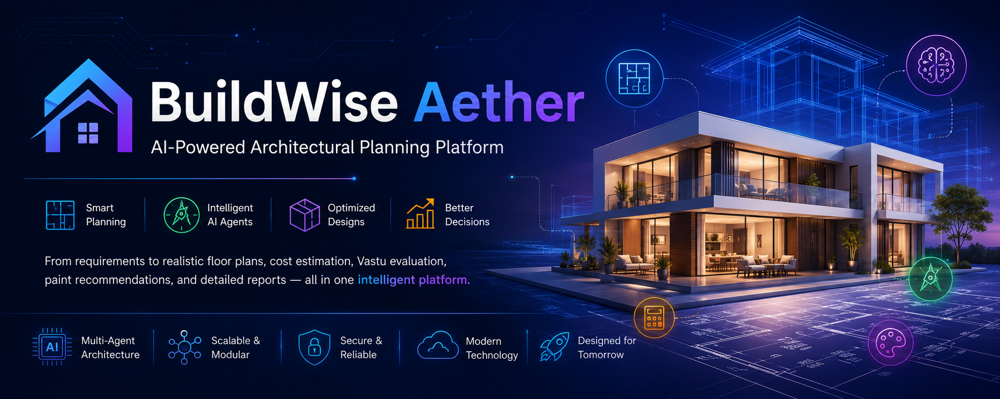
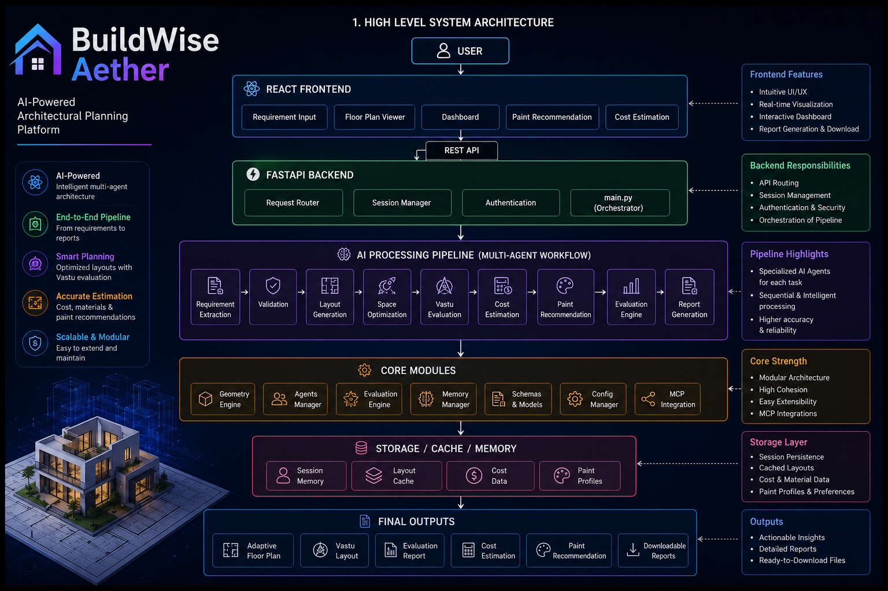
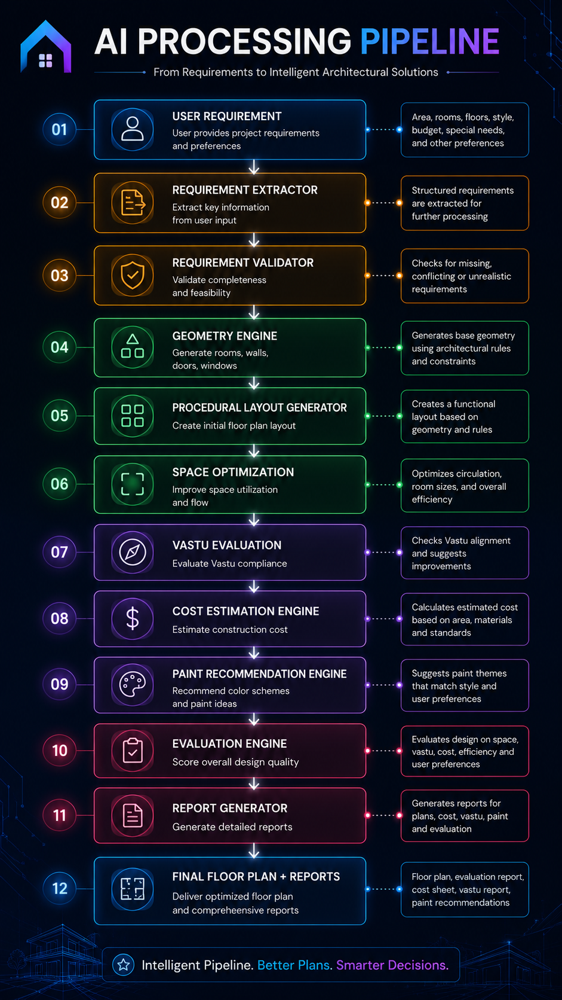
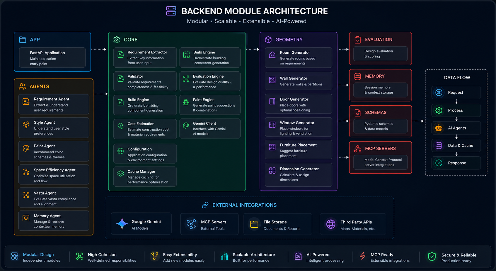
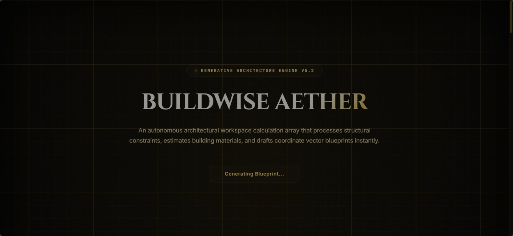
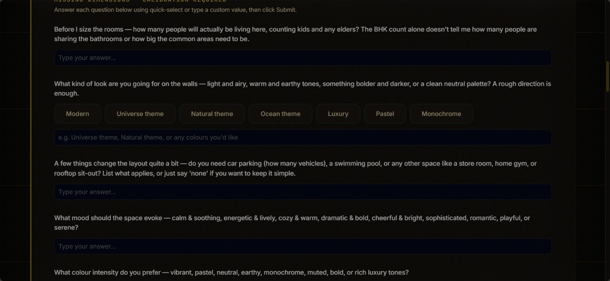
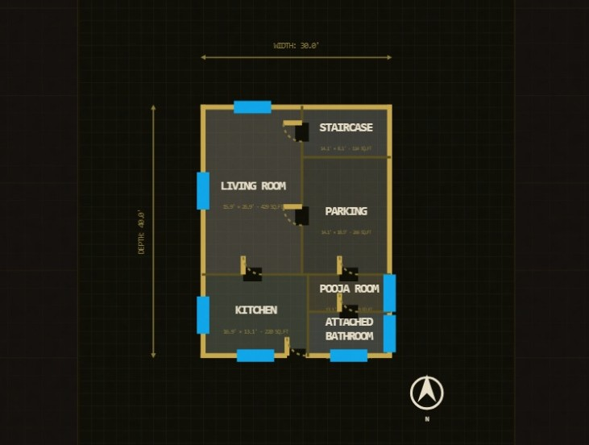
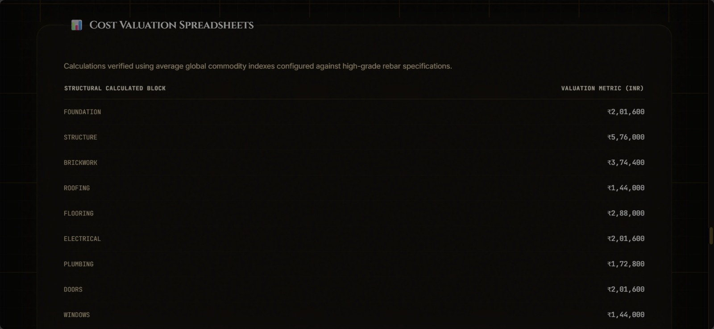
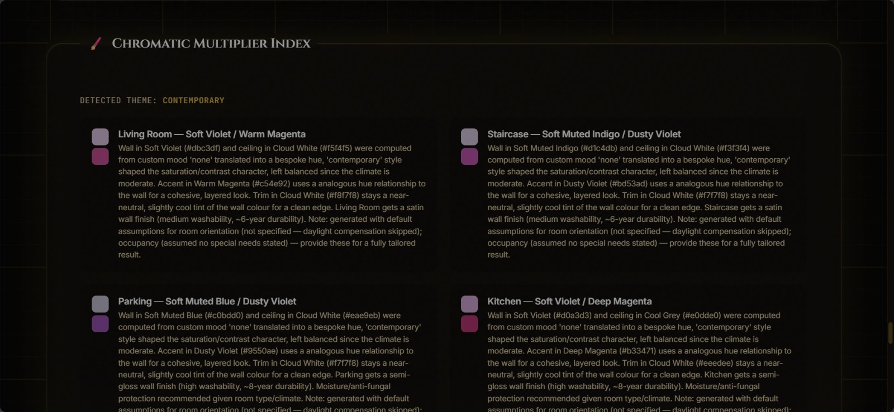

<p align="center">

</p>

# 🏗️ BuildWise Aether

### AI-Powered Architectural Planning Platform

> An AI-assisted architectural planning platform that streamlines residential floor plan generation, Vastu evaluation, cost estimation, paint recommendation, and project reporting through a modular multi-agent workflow.


---

## 🌐 Live Demo:

**Frontend:** https://buildwise-aether-frontend.vercel.app

**Backend API:** https://buildwise-aether-backend.onrender.com

**API Documentation:** https://buildwise-aether-backend.onrender.com/docs


---

## 📑 Table of Contents

- [Executive Summary](#-executive-summary)
- [Problem Statement](#-problem-statement)
- [Why AI Agents?](#-why-ai-agents)
- [Key Features](#-key-features)
- [System Architecture](#-system-architecture)
- [AI Processing Pipeline](#-ai-processing-pipeline)
- [Project Structure](#-project-structure)
- [Technology Stack](#-technology-stack)
- [Security](#-security)
- [Installation](#-installation)
- [Application Screenshots](#-application-screenshots)
- [Future Roadmap](#-future-roadmap)
- [License](#-license)

# 📖 Executive Summary

BuildWise Aether is an AI-powered architectural planning platform that automates the early planning phase of residential construction. Instead of relying on multiple disconnected tools, users interact with a single AI-powered workflow that transforms project requirements into optimized layouts, evaluates Vastu compliance, estimates construction costs, recommends paint themes, and generates downloadable reports.

The platform follows a modular multi-agent architecture built with **React**, **FastAPI**, **Google ADK multi-agent framework powered by Gemini models.**, and **MCP integrations**. Each module is isolated, scalable, and easy to extend.

---

# 🎯 Problem Statement

Traditional residential planning requires architects and homeowners to perform several independent tasks:

- 📋 Requirement collection
- 🏠 Floor planning
- 📐 Space optimization
- 🧭 Vastu analysis
- 💰 Cost estimation
- 🎨 Paint selection
- 📄 Report preparation

This process is time-consuming and often requires switching between multiple software tools.

**BuildWise Aether** unifies these activities into a single intelligent AI-assisted platform.

---

# 💡 Why AI Agents?

Instead of relying on one monolithic AI model, BuildWise Aether uses multiple specialized AI agents, each responsible for a specific architectural planning task.

### Specialized AI Agents

- 📝 Requirement Agent
- 📐 Geometry Agent
- 🏡 Space Optimization Agent
- 🧭 Vastu Evaluation Agent
- 💰 Cost Estimation Agent
- 🎨 Paint Recommendation Agent
- 📊 Evaluation Agent
- 📄 Report Generation Agent

This modular multi-agent architecture improves:

- Scalability
- Maintainability
- Reasoning quality
- Future extensibility

---

# ✨ Key Features

- 🤖 AI-assisted architectural planning
- 🏗️ Multi-Agent workflow
- 📐 Procedural floor-plan generation
- 📊 Space optimization
- 🧭 Vastu evaluation
- 💰 Construction cost estimation
- 🎨 AI-powered paint recommendation
- 📈 Interactive dashboard
- 📄 Automated report generation
- ⚡ FastAPI backend
- ⚛️ React frontend
- 🧩 Modular architecture

---


# 🏛️ System Architecture

<p align="center">

</p>


---

# 🤖 AI Processing Pipeline

<p align="center">
  
</p>

The AI Processing Pipeline transforms user requirements into intelligent architectural solutions by sequentially validating inputs, generating layouts, optimizing space utilization, evaluating Vastu compliance, estimating construction costs, recommending paint themes, and generating comprehensive reports.


---

# 📂 Project Structure

```text
backend/
│
├── app/
│   ├── agents/
│   ├── core/
│   ├── geometry/
│   ├── evaluation/
│   ├── memory/
│   ├── schemas/
│   ├── mcp/
│   └── main.py
│
├── tests/

frontend/
│
├── src/
│   ├── components/
│   ├── hooks/
│   ├── assets/
│   └── App.tsx

mcp_servers/

data/

README.md
```
---

# ⚙️ Backend Module Architecture

The backend follows a modular architecture where independent packages are responsible for AI reasoning, geometry generation, evaluation, memory management, schemas, and external integrations.

<p align="center">
  
</p>

Each module is isolated, making the application easier to maintain, test, and extend.

# ⚙️ Technology Stack

| Layer | Technology |
|--------|------------|
| Frontend | React + TypeScript |
| Styling | Tailwind CSS |
| Backend | FastAPI |
| Programming Language | Python |
| AI Framework | Google ADK |
| AI Model | Gemini |
| Architecture | Multi-Agent System |
| Communication | REST API |
| Integration | MCP |

---

# 🔒 Security

BuildWise Aether follows secure software development practices:

- 🔐 Environment variables for API keys
- ✅ Input validation
- 🛡️ Modular backend architecture
- 🌐 Secure REST communication
- ⚠️ Exception handling and error management

---

# 🚀 Deployability

BuildWise Aether is designed with a modular architecture that enables independent deployment of the frontend and backend services. The application can be deployed locally for development or on cloud platforms for production environments.

### Supported Deployment Platforms

- 🐳 Docker
- 🚂 Railway
- 🎨 Render
- ☁️ Azure App Service
- ☁️ AWS
- ☁️ Google Cloud Platform

### Deployment Architecture

```text
React Frontend
      │
      ▼
FastAPI Backend
      │
      ▼
Multi-Agent Processing Engine
      │
      ▼
AI Services & MCP Integrations
```

The modular deployment strategy simplifies scaling, maintenance, and future enhancements while allowing each component to be deployed independently.

---

# 🚀 Installation

### Clone the Repository

```bash
git clone https://github.com/Senthamizh-Selvi18/buildwise-aether
cd buildwise-aether
```

---

## Backend Setup

```bash
pip install -r requirements.txt
uvicorn app.main:app --reload
```

---

## Frontend Setup

```bash
npm install
npm run dev
```

---

# 📷 Application Screenshots

## 🏠 Home Page

<p align="center">

</p>

---

## 📝 Requirement Collection

<p align="center">

</p>

---

## 📐 Floor Plan Generation

<p align="center">

</p>

---

## 💰 Cost Estimation

<p align="center">

</p>

---

## 🎨 Paint Recommendation

<p align="center">

</p>

---

# 🌍 Future Roadmap

Upcoming enhancements include:

- 🏢 Multi-floor building planning
- 🧱 3D visualization
- 🪵 Material recommendation
- 🏗️ Structural analysis
- 🌱 Energy efficiency analysis
- ☁️ Cloud deployment
- 🔐 User authentication
- 💾 Project persistence

---

# 📜 License

This project is licensed under the MIT License. See the LICENSE file for details.

---

# 👨‍💻 Author

**Senthamizh Selvi I**

- GitHub: https://github.com/Senthamizh-Selvi18
- LinkedIn: https://linkedin.com/in/senthamizh-selvi-i-298451359

